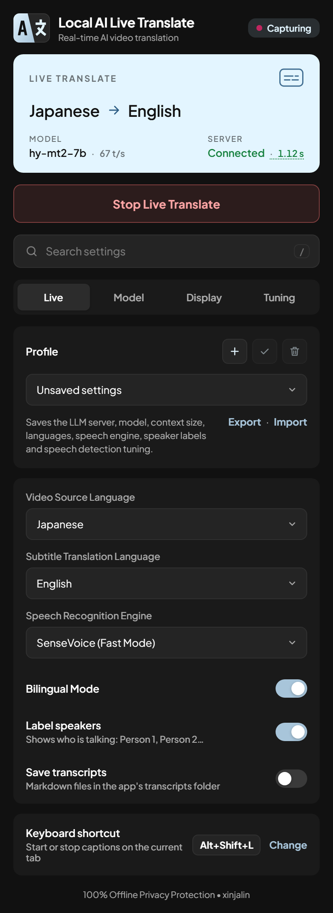

# Local AI Live Translate

Real-time translated subtitles for any video or stream playing in Chrome. Speech recognition and
translation run on your own PC, with a local model in LM Studio (or Ollama). Online AI providers —
Qwen, OpenAI, Anthropic, DeepSeek, Google Gemini and xAI Grok — can be turned on as an option.

**📖 Guides, troubleshooting and model benchmarks:
[xinjalin.github.io/Local-AI-Live-Translate-docs](https://xinjalin.github.io/Local-AI-Live-Translate-docs/)**

<table>
  <tr>
    <td></td>
    <td></td>
  </tr>
</table>

## Features

- **24 languages**, including Cantonese as a video language, with the original line alongside the
  translation if you like
- **Fast:** a subtitle typically appears about a second after the speaker stops
- **Private:** everything runs on your PC; nothing is sent online unless you turn on an online provider
- **Speaker labels**, saved **profiles** and **display configs**, **themes** (including your own), and
  a popup in **10 languages**

## Quick start

You need **Windows 10 or 11 (64-bit)**, **Chrome** (or another Chromium browser) and
**[LM Studio](https://lmstudio.ai)** 0.4 or newer.

1. **Download** `Local-AI-Live-Translate-<version>-windows-x64.zip` from
   [Releases](https://github.com/xinjalin/Local-AI-Live-Translate/releases/latest) and unzip it to a
   short path, such as `C:\LocalAI\`.
2. **Download a model in LM Studio** — **Hy-MT2-7B** (`tencent/Hy-MT2-7B-GGUF`, Q8_0) — and start its
   server (Developer tab).
3. **Start the app:** double-click `START_Local_AI_Live_Translate.bat` and leave the window open.
4. **Load the extension:** `chrome://extensions` → **Developer mode** → **Load unpacked** → the
   `extension` folder.
5. **Play a video**, click the extension icon, pick your languages and press **Start Live Translate**.

Running from the source code, Ollama, and updating:
[Install guide](https://xinjalin.github.io/Local-AI-Live-Translate-docs/getting-started/install/).

## Which model?

**Hy-MT2-7B Q8_0** (8 GB) is the best all-rounder. With less video memory, **Hy-MT2-1.8B Q8_0**
(1.9 GB) is about 3 points less accurate and more than twice as fast.
→ [Compare every model we've tested, by language](https://xinjalin.github.io/Local-AI-Live-Translate-docs/models/)

## Privacy

Speech recognition and translation run on your PC, and there is no online fallback. Online providers
are off by default and only used once you turn them on; API keys stay in the browser's private
extension storage and only go to their own provider.
→ [Privacy](https://xinjalin.github.io/Local-AI-Live-Translate-docs/privacy/) ·
[Cloud providers & API keys](https://xinjalin.github.io/Local-AI-Live-Translate-docs/guide/cloud-providers/)

## Development

See [DEVELOPMENT.md](DEVELOPMENT.md). Releases are built by GitHub Actions from a version tag and
published on the [Releases page](https://github.com/xinjalin/Local-AI-Live-Translate/releases) with
SHA-256 checksums. The docs site's source, and the benchmark behind the model comparison, are in
[Local-AI-Live-Translate-docs](https://github.com/xinjalin/Local-AI-Live-Translate-docs).

## License and credits

Local AI Live Translate is by **xinjalin** (co-author: Claude Opus 5.5) and open source under the
[MIT License](LICENSE). The speech models, Python and the Python packages it downloads keep their own
licences — see [THIRD_PARTY_NOTICES.md](THIRD_PARTY_NOTICES.md).

It started from [LiveCaption](https://github.com/begin0808/LiveCaption) by begin0808 (Studio0808),
whose design inspired this one and parts of whose extension code it still contains (MIT License,
per its README). Thank you!
